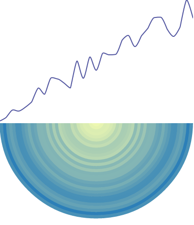
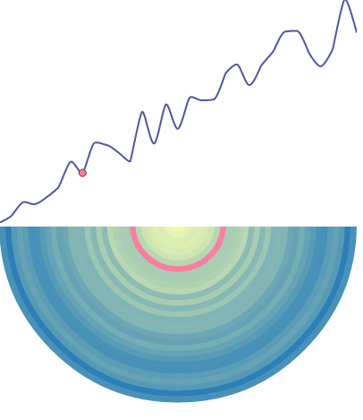

# linked-highlighting-react-d3-reflux
An example of doing linked highlighting using [React](https://facebook.github.io/react/),
[D3.js](http://d3js.org/) and [Reflux](https://github.com/spoike/refluxjs). The project base
was generated using [Yeoman](http://yeoman.io/)'s [react-webpack generator](https://github.com/newtriks/generator-react-webpack).

A line chart and a radial heatmap are drawn, rendering the same set of data. When the user mouses over either chart,
highlighting marks are drawn on both charts.

**Demo**: http://pbeshai.github.io/linked-highlighting-react-d3-reflux/



*Charts with no highlighting*



*Charts with linked highlighting on mouse over*

## Installation

Install npm packages

```npm install```


## Usage

Use grunt to start the web server

```grunt serve```

This will start the `webpack-dev-server` and open a browser to the locally running connect server.


## Components

This example uses two main components: 
  
  * **LineChart** - Draws an SVG path representing passed in data
  * **RadialHeatmap** - Draws a radial heatmap with SVG circles based on passed in data

### LineChart

Draws an SVG path representing passed in data, highlights points on mouse over. Supports linked highlighting via the highlight property.

Prop  | Type | Required | Description
------| ---- | -------- | -----------
data  | array | yes | An array of objects used to draw the points in the line
height | number | yes | The height of the chart
highlight | object | no | The point in the data array to be highlighted (default: undefined)
width | number | yes | The width of the chart
xKey | string | no | The key in the data objects to be read for the x position (default: x)
yKey | string | no | The key in the data objects to be read for the y position (default: y)

This component handles mouse move behaviour using D3's event system to take advantage of the d3.mouse function. When a user hovers over this chart, a ChartActions.highlight is called, passing the closest data point as an argument.

### RadialHeatmap

Draws a radial heatmap with SVG circles based on passed in data, highlights circles on mouse over. Supports linked highlighting via the highlight property.

Prop  | Type | Required | Description
------| ---- | -------- | -----------
colorKey | string | no | The key in the data objects to be read for the color value (default: color)
data  | array | yes | An array of objects used to draw the points in the line
height | number | yes | The height of the chart
highlight | object | no | The point in the data array to be highlighted (default: undefined)
radiusKey | string | no | The key in the data objects to be read for the radius value (default: r)
width | number | yes | The width of the chart

This compopnent handles mouse behaviour using React's event system, listening for *mouseover* and *mouseout* events on the circles rendered.

## Author

By Peter Beshai [@pbesh](http://twitter.com/pbesh)
